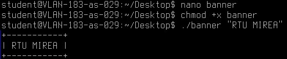
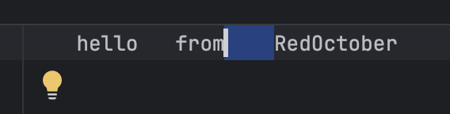

# Практическое занятие №1. Введение, основы работы в командной строке


## Задача 1
```cut -d: -f1 /etc/passwd |sort```


## Задача 2
```cat /etc/protocols | awk '{print $2, $1}' | sort -rn | head -n 5 | awk '{printf "%d %s\n", $1, $2}'```


## Задача 3
```
#!/bin/bash
# Проверяем, был ли передан аргумент

if [ $# -eq 0 ]; then

    echo "Использование: $0 \"Ваш текст\""

    exit 1

fi

# Получаем текст из аргумента

text="$1"

# Вычисляем длину текста

length=${#text}

# Создаем верхнюю и нижнюю границы

border=$(printf "%0.s-" $(seq 1 $((length + 2))))

border="+$border+"

# Выводим баннер

echo "$border"

echo "| $text |"

echo "$border"
```            



## Задача 4
```
grep -oE '\b[a-zA-Z_][a-zA-Z0-9_]*\b' hello.go | grep -vE '\b(int|void|return|if|else|for|while|include|stdio)\b' | sort | uniq
```
### code is presented in the file code/hello.go


## Задача 5
```
chmod +x reg
./reg banner
```
### code is presented in the file bash/banner and bash/reg


## Задача 6
```
chmod +x check_comment.sh
./check_comment.sh
```
### code is presented in the file bash/check_comment.sh


## Задача 7
```
chmod +x find_duplicates.sh
./find_duplicates.sh /Users/aslav/Documents/cdr
```
### code is presented in the file bash/find_duplicates.sh


## Задача 8
```
go run archiver.go /Users/aslav/Documents/cdr  .log
```
### code is presented in the file code/archiver.go


## Задача 9
```
cd code
go run replacer.go /Users/aslav/Desktop/RTU_MIREA_2COURCE/КонфигУправ/1Pract/trash/testFor8.txt testFor8output.txt

```
### code is presented in the file code/replacer.go




## Задача 10
```
cd code
go run dirReader.go /Users/aslav/Downloads 
```
### code is presented in the file code/dirReader.go


